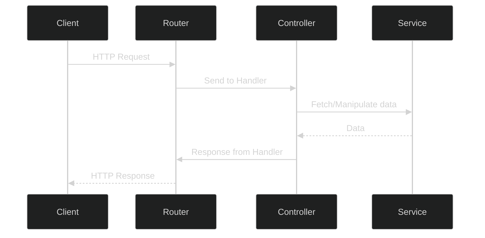
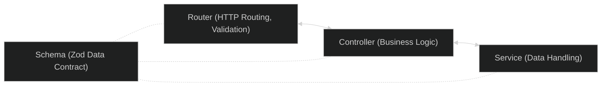

# Pragma API Design

This document details the internal functioning and processes of every backend services in the Pragma Web monorepo.

Each service is based on a Router-Controller-Service pattern, where:

- The **Router** handles the HTTP requests and redirects them to the appropriate Controller.
- The **Controller** validates the incoming data, checks permissions, and communicates with the Service to handle the business logic.
- The **Service** handles database requests and external fetches, encapsulating the business logic from a data perspective.

## HTTP Requests and Responses

An HTTP Request is composed of:

- **HTTP Verb**: (aka **Method**) This represents the desired action to be performed. Examples include GET, POST, PUT, DELETE.
- **Headers**: These provide additional information about the request. For example, the 'authorization' header provides authentication credentials.
- **Body**: This is the data to be sent to the server. It is used in methods like POST and PUT.
- **Params**: These are variables in the URL that identify specific resources.
- **Query Params**: These are optional key-value pairs that appear after the '?' in a URL.
- **Route**: This specifies the path to the resource on the server.

Here is an example of a POST request:

```http
POST /v1/users HTTP/1.1
Host: api.example.com
User-Agent: insomnia/2021.5.2
Content-Type: application/json
Authorization: Bearer apiKey_12345678

{
  "name": "John Doe",
  "email": "john.doe@example.com"
}
```

And the response could be:

```http
HTTP/1.1 201 Created
Content-Type: application/json
Date: Sat, 15 May 2023 23:28:56 GMT
Content-Length: 78

{
  "id": "123",
  "name": "John Doe",
  "email": "john.doe@example.com",
  "createdAt": "2023-05-15T23:28:56.782Z"
}
```

And here is an example of a GET request with an URL param and a query param:

```http
GET /v1/users/123?fields=name,email HTTP/1.1
Host: api.example.com
User-Agent: insomnia/2021.5.2
Authorization: Bearer apiKey_12345678
```

And the response could be:

```http
HTTP/1.1 200 OK
Content-Type: application/json
Date: Sat, 15 May 2023 23:28:56 GMT
Content-Length: 50

{
  "name": "John Doe",
  "email": "john.doe@example.com"
}
```

In this GET request, `123` is the URL param (representing a user ID) and `fields=name,email` is the query param (indicating that only the name and email fields should be returned in the response).

## Internal Functioning

The Pragma web structure follows a clear and efficient workflow which leverages the router-controller-service pattern. This ensures a clean separation of concerns and efficient data handling. The workflow is as follows:

1. **Router**: When a request is made to our service, the Fastify router takes in the request. It then validates this request against the defined Zod schema to ensure it has the right structure and contains the expected data. If the request passes validation, the router will then call the appropriate handler function from the controller based on the request's route and HTTP method. For more detailed understanding, please refer to the Fastify's [request-response lifecycle](https://www.fastify.io/docs/latest/Reference/Lifecycle/).

2. **Controller**: Once the router passes the request to the controller, the controller takes over the handling of this request. This is where most of the business logic for each request occurs. The controller can check permissions, transform incoming data, and use any required services to fetch or manipulate the data needed to fulfill the request. It is also responsible for handling potential errors and forming proper HTTP responses.

3. **Service**: If required, the controller can call upon a service to handle specific data-related logic. Services are used to handle requests to the database, execute CRUD operations, and handle external fetches if required. These service functions return the requested data back to the controller.

4. **Response**: Once the controller has received the required data from the services and performed necessary data transformations, it will call the proper Fastify reply function to form the HTTP response. This response is then passed back to the router.

5. **Router**: Once the router receives the response from the controller, it takes care of sending the response back to the client.

_This diagram provides a simple view of the HTTP request and response lifecycle in the API:_



This efficient workflow allows for clean and maintainable code, ensuring that each component of our API has a specific and well-defined role, leading to a more manageable and scalable system.

## Zod and Fastify-Zod

Zod is used for input validation and parsing. It ensures that the incoming data matches the required schema. If the data does not conform to the schema, Zod throws an error. All of our schema logic is encapsulated into a designated file named `<resource>.schema.ts` for each resource. For example, the schemas for a User resource would be in a `user.schema.ts` file.

Fastify-Zod is a Fastify plugin that integrates Zod into Fastify. This simplifies the process of request and response validation, and automatically generates Swagger documentation from Zod schemas.

_This flowchart represents the relations involving Router, Controller, and Service components. A central Schema, representing a data contract, interacts with all other components._



## Prisma

Prisma is an open-source database toolkit. It's used in our Service layer as an Object-Relational Mapping (ORM) tool to interact with the database. With Prisma, we write database queries in TypeScript. This offers the advantage of type safety and autocompletion, making our code more reliable and easier to write and understand.

## Fastify-Swagger

Fastify-Swagger is used to generate Swagger documentation for the API. Swagger (now known as OpenAPI) is a framework for describing the structure of APIs. This helps in understanding how the API works without having to read the source code or documentation.

## Final Notes

This API server is built on solid principles of separation of concerns, encapsulation, and modularity. This makes it robust, scalable, and maintainable. The use of Fastify, Zod, and Prisma further enhances the quality and reliability of the server.
